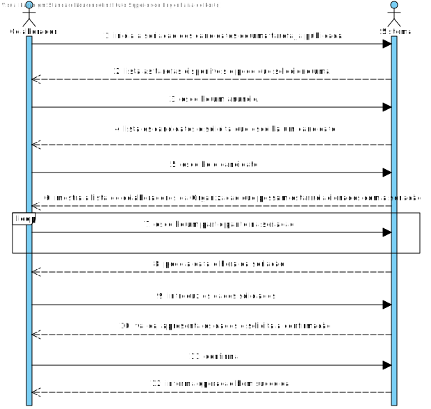
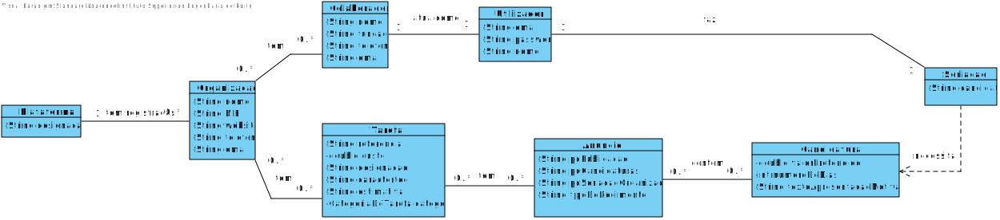
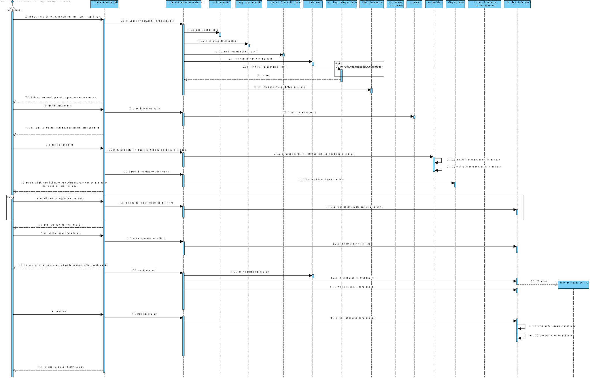
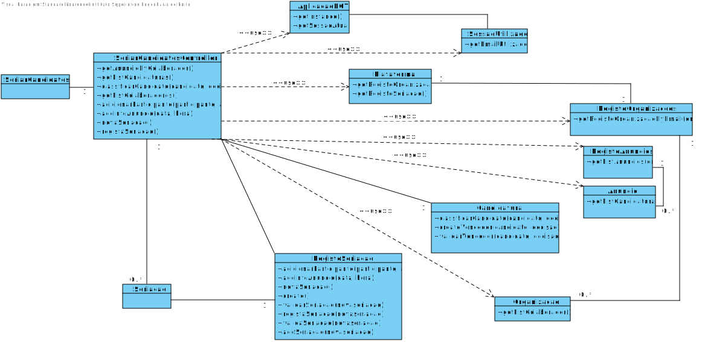

#UC10 Seriar Anuncio

## 1. Engenharia de Requesitos

### Formato Breve

Através da publicação de uma tarefa resulta um anúncio. O colaborar inicia a seriação dos candidatos a uma tarefa previamente criada e publicada por si mesmo. O Sistema mostra todas as tarefas disponíveis e pede ao colaborador para escolher uma delas. O Colaborador seleciona uma. O sistema lista todos os candidatos à tarefa e pede que o Colaborador escolha um deles para ser selecionado. O Colaborador introduz os dados solicitados pela plataforma. O Sistema mostra a lista de Colaboradores da Organização que possam estar relacionados com a seriação. Escolhe um ou vários participantes. O Sistema pede a data e hora da seriação. O Colaborador introduz os dados solicitados. O Sistema valida, apresenta os dados e solicita a confirmação. O Colaborador confirma. O Sistema informa operação bem sucedida.

### SSD



### Formato Completo

#### Ator principal

Colaborador de Organização

#### Partes interessadas e seus interesses
* **Colaborador:** pretende que a tarefa seja atribuída a alguém.
* **Organização** pretende que as tarefas sejam efetuadas pelos freelancers.
* **T4J:** pretende que a plataforma permita aos freelancers receber os trabalhos para os quais se candidataram. Que os colaboradores possam atribuir os trabalhos aos freelancers( com os seus métodos).
* **Freelancers** sejam capazes de visualizar os anúncios para o que estão aptos.

#### Pré-condições
* Exista uma tarefa devidamente criada pelos Colaboradores de uma Organização.
* Que existam Colaboradores de Organização.

#### Pós-condições
* Que os colaboradores consigam ver os candidatos à sua tarefa e tomar a decisão de lhes atribuir ou não a tarefa ao freelancer.
* Caso os colaboradores atribuam a tarefa, que o candidato fique registado como responsável por realizar a tarefa.

### Cenário de sucesso principal (ou fluxo básico)

1. O Colaborador inicia a seriação dos candidatos de uma tarefa já publicada.
2. O Sistema lista as tarefas disponíveis e pede que selecione uma.
3. O Colaborador escolhe um anúncio.
4. O Sistema lista os candidatos e solicita que escolha um candidato. 
5. O Colaborador escolhe o candidato
6. O Sistema mostra a lista de colaboradores da Organização que possam estar relacionados com a seriação.
7. O Colaborador escolhe ou um ou vários participantes na seriação.
8. O Sistema pede a data e hora da seriação.
9. O Colaborador introduz os dados solicitados.
10. O Sistema valida, apresenta os dados e solicita a confirmação.
11. O Colaborador confirma.
12. O Sistema informa operação bem sucedida.

#### Extensões (ou fluxos alternativos)

*a. O colaborador solicita o cancelamento da seriação do anúncio.
>	O caso de uso termina.

2.a O Sistema deteta que a lista de tarefas(anúncio) se encontra vazia.
>	1.O Sistema informa o Colaborador sobre a situação.
>	2.O Sistema permite ao Colaborador publicar uma tarefa (UC8).
>
	>	2.a O Colaborador não quer publicar 		uma tarefa.
	>	2.b O caso de uso termina.

3.a. O Colaborador não encontra a tarefa(anúncio) desejada.
>	1. O Colaborador informa o sistema de tal facto.
>	2. O Sistema permite ao Colaborador publicar uma tarefa (UC8).

4.a. A lista de candidatos se encontra vazia.
> 	1. O Sistema informa o Colaborador sobre a situação.
>	2. O caso de uso termina.

5.a. O Colaborador não escolhe nenhum candidato.
>	1.O Sistema avisa o Colaborador do sucedido.
>	2. O Sistema permite escolher um candidato (passo 5).
>	2.a. O Colaborador não quer escolher um candidato. O caso de uso termina.

6.a. A lista de Colaboradores da Organização apenas é constituída pelo ator.
>	1. O sistema informa o colaborador sobre o sucedido.
>	2. O sistema permite introduzir Colaboradores da Organização(UC5).
>
	>2.a. O Colaborador usa a UC5.
	>2.b. O Colaborador não usa a UC5.

9.a. A data e a hora foram introduzidas de forma incorreta.
>	1. O Sistema informa o Colaborador do sucedido e permite introduzir de forma correta.
>	2. O Colaborador introduz os dados de forma correta.
>
	>2.a. O Colaborador não quer introduzir de novo. O caso de uso termina.

10.a. A validação falha. O Sistema informa sobre o sucedido. O caso de uso reinicia.

#### Requisitos especiais
\-

#### Lista de Variações de Tecnologias e Dados
\- Utilizar um software externo de datas e horas, se a seriação foi efetuada no momento da introdução dos dados.

#### Frequência de Ocorrência
\-Sempre que o administrador necessitar de definir uma nova categoria de tarefa.

#### Questões em aberto

* A data pode ser gerada pelo sistema em vez de ser introduzida pelo o utilizador?
* Existem outros dados que são necessários?
* Todos os dados são obrigatórios?
* Qual a frequência de ocorrência deste caso de uso?
* Qual é a altura mais propícia para pedir a hora?
* A lista dos candidatos quando é mostrada precisa de estar ordenada por alguma característica?
* Há necessidade de dar notas a todos os candidatos quando apenas querem escolher um dos candidatos e quando pode existir um número extremamente avantajado de candidaturas?
 

## 2. Análise OO

### Excerto do Modelo de Domínio Relevante para o UC



## 3. Design - Realização do Caso de Uso

### Racional

### Sistematização ##

 Do racional resulta que as classes conceptuais promovidas a classes de software são:

 * AplicacaoPOT
 * SessaoUtilizador
 * Plataforma
 * RegistoOrganizacao
 * RegistoAnuncios
 * Anuncio
 * Candidatura
 * Organização
 * RegistoSeriacao
 * Seriacao


Outras classes de software (i.e. Pure Fabrication) identificadas:  

 * SeriarCandidatosUI
 * SeriarCandidatosController

###	Diagrama de Sequência



###	Diagrama de Sequência Secundário



###	Diagrama de Classes



































