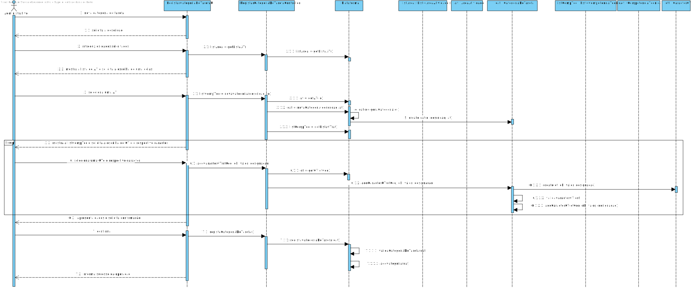

# UC3 - Definir Categoria (de Tarefa)

## 1. Engenharia de Requisitos

### Formato Breve

O administrativo inicia a definição de uma nova categoria de tarefa. O sistema solicita os dados necessários (i.e. descrição breve e detalhada, a área de atividade associada e a lista de competências técnicas requeridas). A categoria de tarefa criada pelo o administrativo pode não possuir competências técnicas e por isso pode não selecionar nenhuma. O administrativo introduz os dados solicitados. O sistema valida e apresenta os dados ao administrativo, pedindo que os confirme. O administrativo confirma. O sistema solicita a/s competência/s de categoria obrigatória ou desejável (especificando o seu grau de proficiência mínimo exigido (e.g. baixo, médio, alto)). O administrativo introduz o dado solicitado (ou não). O sistema apresenta os dados e solicita a sua confirmação. O administrativo confirma. O sistema confirma o sucesso da operação. 


### SSD



### Formato Completo

#### Ator principal

Administrativo

#### Partes interessadas e seus interesses
* **Administrativo:** pretende definir categorias de tarefas para que possa especificar as atividades.
* ** Colaborador: ** pretende que as categorias estejam definidas para poder especificar corretamente as suas tarefas.
* **T4J:** pretende que a plataforma permita aos freelancers e aos colaboradores consigam classificar tarefas mais especificas.


#### Pré-condições
Exista uma área de atividade

#### Pós-condições
A informação da categoria de tarefa é registada no sistema.

### Cenário de sucesso principal (ou fluxo básico)

1. O administrativo inicia a definição de uma nova categoria de tarefa  
2. O sistema solicita a descrição.
3. O administrativo introduz a descrição
4. O sistema mostra a lista de áreas de atividades para que seja selecionada uma.
5. O administrativo seleciona uma área de atividade.
6. O sistema mostra a ***lista de competências técnicas referentes à área de atividade previamente selecionada*** para que seja selecionada uma (ou nenhuma).
7. O administrativo escolhe uma competência técnica da lista.
8. O sistema mostra os graus de proficiência aplicáveis a essacompetência técnica e pede para selecionar o grau mínimo exigível bem como o seu carácter (i.e. obrigatória ou desejável).
9. O administrativo seleciona o grau pretendido e introduz carácter da competência técnica.
10. ***Os passos 7 a 9 repetem-se enquanto não forem introduzidas todas as competências técnicas pretendidas.***
11. O sistema valida e apresenta os dados ao administrativo, pedindo que os confirme.
12. O administrativo confirma.
13. O sistema regista os dados e informa o administrativo do sucesso da operação.


#### Extensões (ou fluxos alternativos)

*a. O administrativo solicita o cancelamento da definição da categoria de tarefa.

> O caso de uso termina.

4a. O sistema deteta que a lista de áreas de atividades está vazia.
>	1. O sistema informa o administrativo de tal facto.
>	2. O sistema permite a definição de uma nova área de atividade (UC2).
>
	>	2a. O administrativo não define uma área de atividade. O caso de uso termina.

5a. O administrativo não encontra a área de atividade pretendida.
>	1. O administrativo informa o sistema de tal facto.
>	2. O sistema permite a definição de uma nova área de atividade (UC2).
>
	>	2a. O administrativo não define uma área de atividade. O caso de uso termina.

6a. O sistema deteta que a lista de competências técnicas está vazia.
> 1. O sistema informa o administrativo de tal facto.
> 2. O sistema permite a especificação de uma nova competência técnica (UC4).
> 
	> 2a. O administrativo não especifica uma nova competência técnica. O caso de uso termina.
> 3. O administrativo avisa que não quer associar competências técnicas. O caso de uso termina.

7a. O administrativo não encontra a competência técnica pretendida.
>	1. O administrativo informa o sistema de tal facto.
>	2. O sistema permite a especificação de uma nova competência técnica (UC4).
>	
	>	2a. O administrativo não especifica uma competência técnica. O caso de uso termina.
7b. O sistema verifica que não foram escolhidas competências técnicas.
>	1.O sistema avisa o administrativo do acontecimento.
>	2. O administrativo confirma que não quer competências técnicas associadas à Categoria de Tarefa 

9a. O administrativo não escolhe o seu caracter ou grau de importância da Competência técnica.
>	1. O sistema informa que não escolheu o seu caracter ou um grau de importância.
>	2. O sistema permite definir o grau (passo 8 e 9).
	>	2a. O administrativo não define o seu caracter ou o grau. O sistema invalida o ato.

11a. Dados mínimos obrigatórios em falta.
>	1. O sistema informa quais os dados em falta.
	>	1.a Se a Categoria de Tarefa não tiver Competências de Tarefa associadas o sistema avisa do acontecimento e permite adicionar as mesma.
		>1.a.a Se o Administrativo não adicionar Competências permitir a definição da Categoria. 
>	2. O sistema permite a introdução dos dados em falta (passo 3).
>
	>	2a. O administrativo não altera os dados. O caso de uso termina.

11b. O sistema deteta que os dados (ou algum subconjunto dos dados) introduzidos devem ser únicos e que já existem no sistema.
>	1. O sistema alerta o administrativo para o facto.
>	2. O sistema permite a sua alteração (passo 3).
>
	>	2a. O administrativo não altera os dados. O caso de uso termina. 

11c. O sistema deteta que os dados introduzidos (ou algum subconjunto dos dados) são inválidos.
>	1. O sistema alerta o administrativo para o facto.
>	2. O sistema permite a sua alteração (passo 3).
>	
	> 2a. O administrativo não altera os dados. O caso de uso termina. 

#### Requisitos especiais
\-

#### Lista de Variações de Tecnologias e Dados
\-

#### Frequência de Ocorrência
\-Sempre que o administrador necessitar de definir uma nova categoria de tarefa.

#### Questões em aberto

* O identificador da categoria de tarefa tem que obedecer a alguma regra (e.g. ser sequencial, e.g. ser "String" ou "float")?
* Existem outros dados que são necessários?
* Todos os dados são obrigatórios?
* Qual a frequência de ocorrência deste caso de uso?

## 2. Análise OO

### Excerto do Modelo de Domínio Relevante para o UC



## 3. Design - Realização do Caso de Uso

### Racional

| Fluxo Principal | Questão: Que Classe... | Resposta  | Justificação  |
|:--------------  |:---------------------- |:----------|:---------------------------- |
|1. O administrativo inicia o registo de uma nova categoria de tarefa.|... interage com o utilizador?| RegistarCategoriaDeTarefaUI |Pure Fabrication|
| |... coordena o UC?| RegistarCategoriaDeTarefaController |Controller|
| |... cria instâncias de Categoria?|Plataforma|Creator(regra1)|
| |... gera o identificador único da Categoria? | Plataforma | IE: no MD a Plataforma tem e, portanto, conhece todas as Categorias.
|2. O sistema solicita os dados necessários para a criação da categoria de tarefa (i.e. descrição, área de atividade e lista de competências técnicas requeridas ) .||||
|3. O administrativo introduz os dados solicitados. |... guarda os dados introduzidos?|CategoriaDeTarefa |IE (Information Expert): instância criada no passo 1.|
|4. O sistema mostra a lista de áreas de atividade para que seja selecionada uma.. |...conhece as áreas de atividades? |Plataforma |IE: A Plataforma agrega AreaAtividade. |
|5. O administrativo seleciona uma área de atividade. | ... guarda a área selecionada? | Categoria | IE: instância criada no passo 1. No MD uma Categoria é referente a uma AreaAtividade. |
|6. O sistema mostra a lista de competências técnicas referentes à área de atividade previamente selecionada para que seja selecionada uma.|... conhece as competências técnicas? | Plataforma |IE: A Plataforma agrega/contém CompetenciaTecnica |
| | ...sabe a que área de atividade a competência técnica se refere?| CompetenciaTecnica| IE: cada CompetenciaTecnica conhece a AreaAtividade em que se enquadra. |
|7. O administrativo escolhe uma competência técnica da lista. | … guarda a competência técnica selecionada? | CaraterCT | IE: no MD cada Categoria tem várias CaraterCT sendo cada uma referente a uma CompetenciaTecnica (CT). |
| | … cria instância de CaracterCT | Categoria | IE: no MD cada Categoria tem várias CaraterCT. |
| | … guarda o grau da competência técnica ? | CaracterCT | IE: O CaracterCT já contêm a obrigatoriedade da competência assim pode guardar também o seu grau. |
|8. O sistema solicita indicação do seu caráter (i.e. obrigatória ou desejável). ||||
|9. O administrativo introduz informação relativa ao caráter da competência técnica. | ... guarda a informação introduzida? | CaraterCT |  IE. instância criada no passo 7. |
| Quem guarda a informação em relação ao grau | GrauProficiencia | IE: Instância cirada no passo 9|
|10. Os passos 7 a 9 repetem-se enquanto não forem introduzidas todas as competências técnicas pretendidas. ||||
|11. O sistema valida e apresenta os dados ao administrativo, pedindo que os confirme. | ...valida os dados da Categoria (validação local) | Categoria | IE. A Categoria possui os seus próprios dados. |
|12. O administrativo confirma. ||||
|13. O sistema regista os dados e informa o administrativo do sucesso da operação. | ... guarda a Categoria de tarefa criada? | Plataforma | IE: No MD a Plataforma possui Categoria (de tarefa). |

### Sistematização ##

 Do racional resulta que as classes conceptuais promovidas a classes de software são:

 * Plataforma
 * Administrativo
 * AreaAtividade
 * CategoriaDeTarefa
 * CompetenciaTecnica
 * CaraterCT
 * GrauProficiencia


Outras classes de software (i.e. Pure Fabrication) identificadas:  

 * RegistarCategoriaDeTarefaUI  
 * RegistarCategoriaDeTarefaController

###	Diagrama de Sequência




###	Diagrama de Classes





































