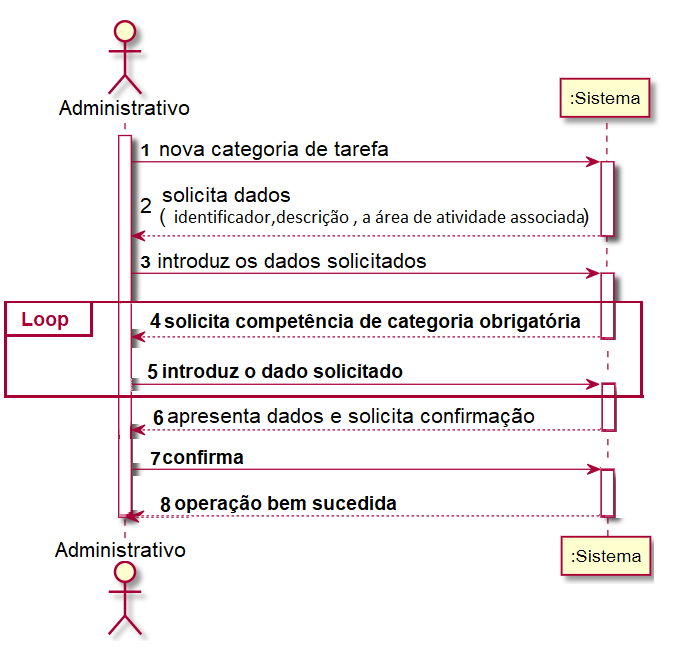
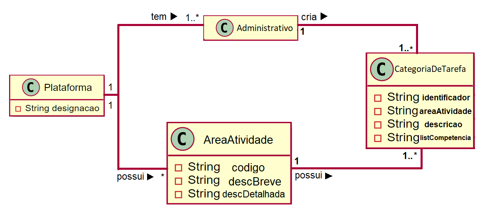
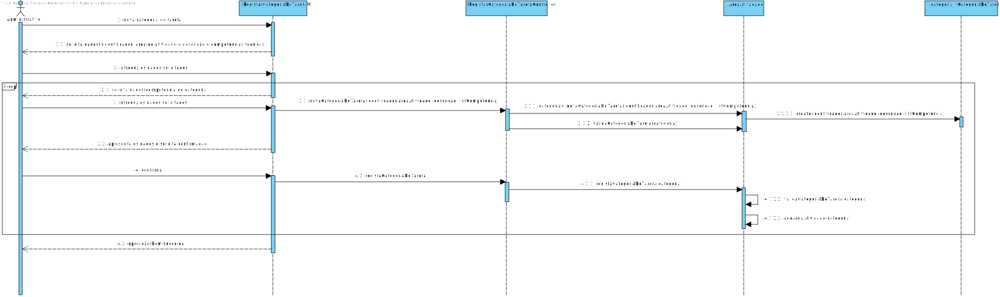
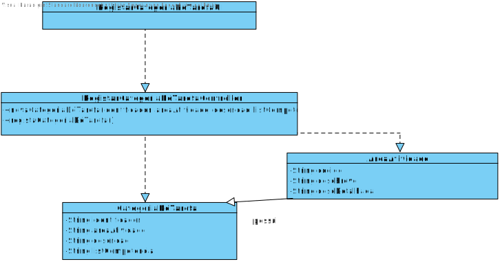

# UC3 - Definir Categoria (de Tarefa)

## 1. Engenharia de Requisitos

### Formato Breve

O administrativo inicia a definição de uma nova categoria de tarefa. O sistema solicita os dados necessários (i.e. identificador,descrição breve e detalhada, a área de atividade associada). O administrativo introduz os dados solicitados. O sistema valida e apresenta os dados ao administrativo, pedindo que os confirme. O administrativo confirma. O sistema solicita a/s competência/s de categoria obrigatória. O administrativo introduz o dado solicitado. O sistema apresenta os dados e solicita a sua confirmação. O administrativo confirma. O sistema confirma o sucesso da operação. 


### SSD



### Formato Completo

#### Ator principal

Administrativo

#### Partes interessadas e seus interesses
* **Administrativo:** pretende definir categorias de tarefas para que possa especificar as atividades.
* **T4J:** pretende que a plataforma permita aos freelancers e aos colaboradores consigam classificar tarefas mais especificas.

#### Pré-condições
Exista uma área de atividade

#### Pós-condições
A informação da categoria de tarefa é registada no sistema.

### Cenário de sucesso principal (ou fluxo básico)

1. O administrativo inicia a definição de uma nova categoria de tarefa  
2. O sistema solicita os dados necessários (i.e. código único, área de atividade e descrição clara e precisa da categoria). 
3. O administrativo introduz os dados solicitados. 
4. O sistema valida e apresenta os dados ao administrativo, pedindo que os confirme. 
5. O administrativo confirma. 
6. O sistema solicita a/s competência/s obrigatória/s
7. O administrativo introduz o/s dado/s solicitado/s.
8. O sistema apresenta os dados e solicita a sua confirmação.
9. O administrativo confirma.
10. O sistemas confirma o sucesso da operação.


#### Extensões (ou fluxos alternativos)

*a. O administrativo solicita o cancelamento da definição da categoria de tarefa.

> O caso de uso termina.

4a. Dados mínimos obrigatórios em falta.
>	1. O sistema informa quais os dados em falta.
>	2. O sistema permite a introdução dos dados em falta (passo 3)
>
	>	2a. O administrativo não altera os dados. O caso de uso termina.

4b. O sistema deteta que os dados (área de atividade ou categoria) introduzidos devem ser únicos e que já existem no sistema.
>	1. O sistema alerta o administrativo para o facto.
>	2. O sistema permite a sua alteração (passo 3)
>
	>	2a. O administrativo não altera os dados. O caso de uso termina.

4c. O sistema deteta que o código é inválido.
> 1. O sistema alerta o administrativo para o facto. 
> 2. O sistema permite a sua alteração (passo 3).
> 
	> 2a. O administrativo não altera os dados. O caso de uso termina. 

8a. Dados mínimos obrigatórios em falta.
>	1. O sistema informa quais os dados em falta.
>	2. O sistema permite a introdução dos dados em falta (passo 7)
>	
	>	2a. O administrativo não altera os dados. O caso de uso termina.


#### Requisitos especiais
\-

#### Lista de Variações de Tecnologias e Dados
\-

#### Frequência de Ocorrência
\-Sempre que o administrador necessitar de definir uma nova categoria de tarefa.

#### Questões em aberto

* 
* 
* 
* 

## 2. Análise OO

### Excerto do Modelo de Domínio Relevante para o UC



## 3. Design - Realização do Caso de Uso

### Racional

| Fluxo Principal | Questão: Que Classe... | Resposta  | Justificação  |
|:--------------  |:---------------------- |:----------|:---------------------------- |
|1. O administrativo inicia o registo de uma categoria de tarefa.|... interage com o utilizador?| RegistarCategoriaDeTarefaUI |Pure Fabrication|
| |... coordena o UC?| RegistarCategoriaDeTarefaController |Controller|
| |... cria instâncias de Organizacao?|Plataforma|Creator(regra1)|
|2. O sistema solicita os dados necessários para a criação da categoria de tarefa (i.e. identificador, a área de atividade, descrição, lista de competências obrigatórias ) .||||
|3. O administrativo introduz os dados solicitados. |... guarda os dados introduzidos?|CategoriaDeTarefa |IE: instância criada no passo 1|
| |... cria instâncias de CategoriaDeTarefa?|AreaAtividade|creator(regra1)|
|4. O sistema valida e apresenta os dados ao administrativo, pedindo que os confirme. |... ...valida os dados da CategoriaDeTarefa (validação local) |CategoriaDeTarefa|IE: possui os seus próprios dados|
| |... valida os dados da CategoriaDeTarefa (validação global)|AreaAtividade|IE: A AreaAtividade possui/agrega Categoria. |
|5. O utilizador não registado confirma. ||||
|6. O sistema regista os dados e informa o administrativo do sucesso da operação.|... guarda a CategoriaDeTarefa criada?| AreaAtividade |IE: No MD a AreaAtividade tem CategoriaDeTarefa |

### Sistematização ##

 Do racional resulta que as classes conceptuais promovidas a classes de software são:

 * Plataforma
 * Administrativo
 * AreaAtividade
 * CategoriaDeTarefa


Outras classes de software (i.e. Pure Fabrication) identificadas:  

 * RegistarCategoriaDeTarefaUI  
 * RegistarCategoriaDeTarefaController

###	Diagrama de Sequência




###	Diagrama de Classes































